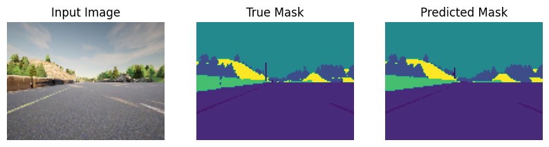

In this [experiment](G_Image_segmentation_Unet.ipynb), I built U-Net, a type of convolutional neural network that is designed for image segmentation task, with the starting code, instructions, training data and utility functions from the [Convolutional Neural Networks](https://coursera.org/learn/convolutional-neural-networks) course (by DeepLearning.AI on Coursera). Image segmentation aims to classify every pixel of the image as belonging to which object.

Unet architecture (showing the layer dimensions and filter sizes as per the original paper on U-Net. However, in the Coursera assignment, only half of the filters are implemented due to computational constraints.)

Here's a sample output of this Unet model:
